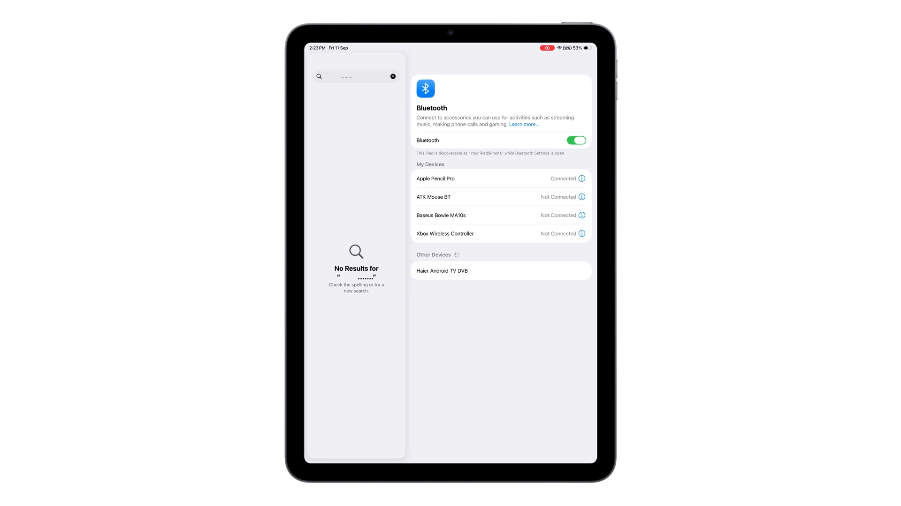
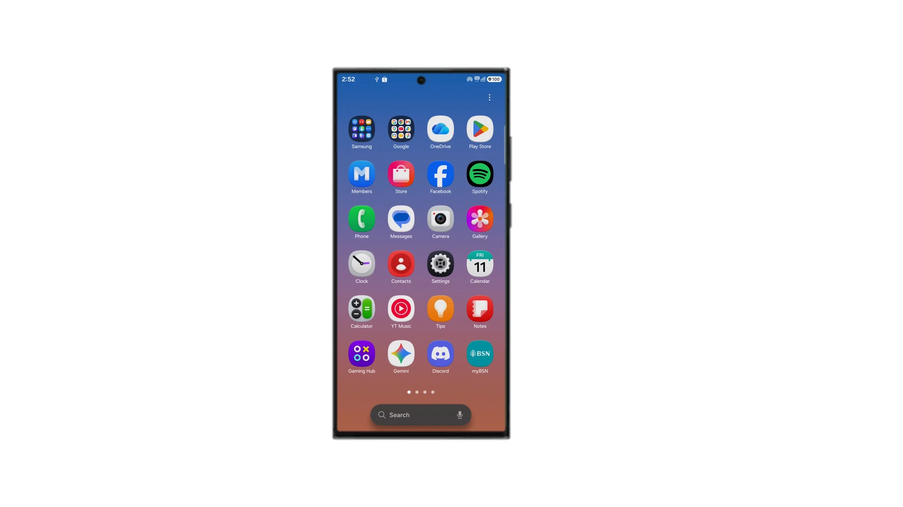

# iMediaBrige

An application that can bridge media information (Currently Playing Track, Artist, etc...) from an iOS/iPadOS device to an Android device.

NOTE: Currently the app uses itunes lookup for the Album Art. Thus, the cover might be incorrect...

## Compatibility

This table is not complete, if you would like to help, please considering writing about it in issues.

| Music Provider | Cover Art     | Track Information | Media Buttons* | Shuffle & Repeat|
| -------------  | ------------- | ------------      |  ------        |---          
| Apple Music    | ✅            |         ✅        |        ✅      |   ✅**  
| Spotify        |       ✅ ***  |         ✅        |        ✅      |    ❌
| Youtube Music  |       ✅ ***  |         ✅        |        ✅      |    ❌

*for forward and rewind buttons, they depend on the implemantation of the Music Provider.

**Apple Music repeat and shuffle buttons do not work on stations or playlist that does not have an end.

***The cover art service uses itunes to find the art. If your playing song has a version on itunes, the art will be shown.

(EX: Apple Music: 30 secs)
## Usage

### Prerequisites.

Both device must have their bluetooth turned on at all times for this app to work.

How to connect.

    1. Pair your phone to your Apple device.

    2. Connect on the app.

