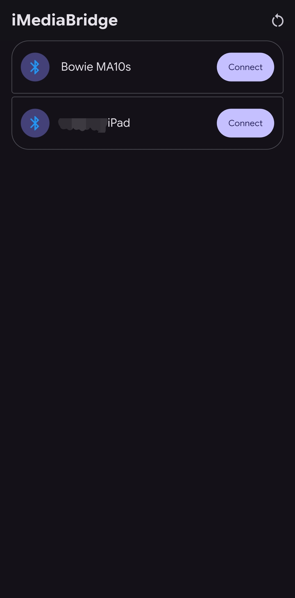
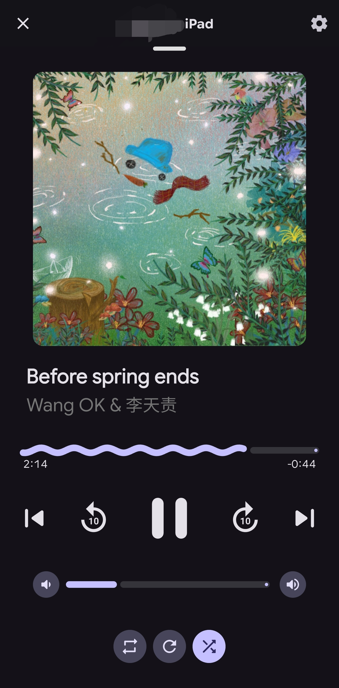
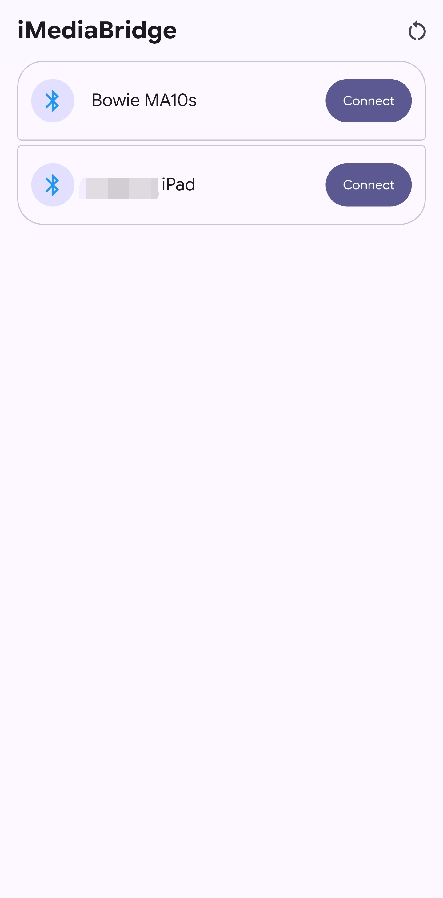
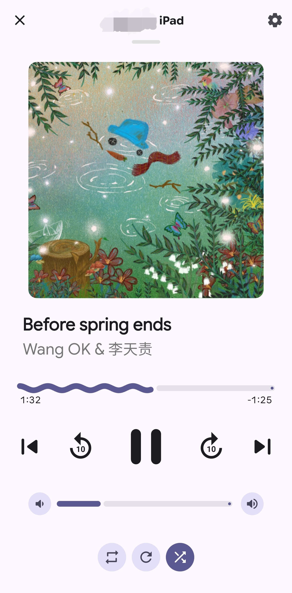

# iMediaBrige

An application that can control & bridge media information (Currently Playing Track, Artist, etc...) from an iOS/iPadOS device to an Android device.

## Compatibility

This table is not complete, if you would like to help, please consider writing about it in issues.

| Music Provider | Cover Art     | Track Information | Media Buttons* | Shuffle & Repeat|
| -------------  | ------------- | ------------      |  ------        |---          
| Apple Music    | ✅            |         ✅        |        ✅      |   ✅**  
| Spotify        |       ✅   |         ✅        |        ✅      |    ❌
| Youtube Music  |       ✅   |         ✅        |        ✅      |    ❌

*for forward and rewind buttons, they depend on the implemantation of the Music Provider.

**Apple Music repeat and shuffle buttons do not work on stations or playlist that does not have an end.

(EX: Apple Music: 30 secs)
## Usage

### Screenshots.

<table>
  <tr>
    <td></td>
    <td></td>
    <td></td>
    <td></td>
  </tr>
</table>

### Prerequisites.

Both device must have their bluetooth turned on at all times for this app to work.

How to connect.

    1. REQUIRED: Pair your android to your Apple device.
    2. Proceed with connection on your phone.

